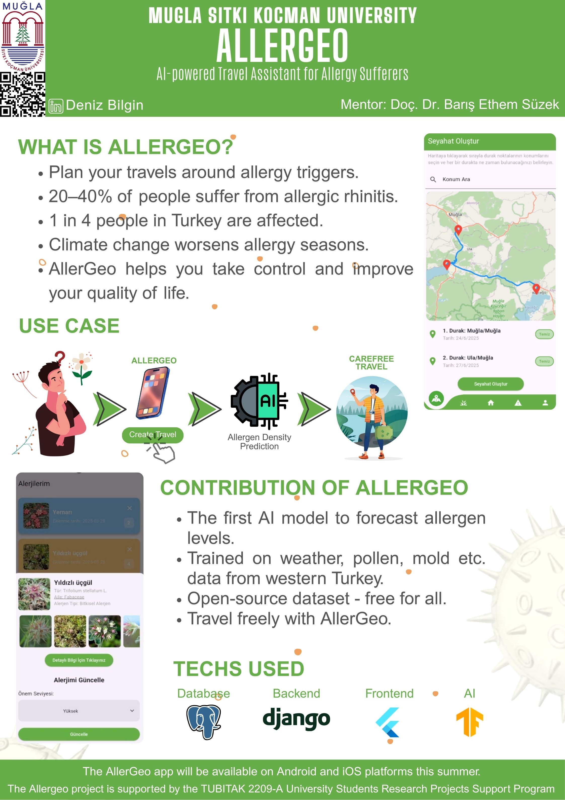

# AllerGeo 🌿📱  
*A mobile app that simplifies travel and daily life by tracking allergens for allergic persons*

## 🧭 About the Project

**AllerGeo** is a mobile health-tech application designed to help individuals with allergies plan their daily routines and travels more comfortably. By analyzing environmental allergen data such as pollen, dust, and mold, AllerGeo provides personalized alerts and recommendations based on the user's allergy profile and location.

## 🚀 Project Status

- 📱 **Reached MVP stage**
- 📅 Scheduled for release on mobile platforms in **Summer 2025**
- 🧠 Developed an **LSTM-based AI model** with an impressive **R² score of 0.89**
- 🏆 Supported by the **TÜBİTAK 2209-A** University Students Research Project Grant

## 🏗️ Tech Stack

| Layer      | Technology                  |
|------------|-----------------------------|
| Backend    | Django (REST API)           |
| Database   | PostgreSQL (3NF normalized) |
| AI/ML      | TensorFlow, Scikit-Learn    |
| Frontend   | [Flutter App (separate repo)](https://github.com/denizbilgin/AllerGeoFrontend) |
| Data APIs  | AccuWeather, GBIF, Pl@ntNet |

## 🧪 AI Model Highlights

- 🌿 Predicts allergen intensity (e.g., pollen, dust, mold) for specific regions and future dates
- 📊 Trained on past environmental data using an **LSTM neural network**
- 📖 Planned to be open-sourced for researchers and developers

## 🗂️ Architecture Overview

- Aggregates data from multiple external APIs (AccuWeather, GBIF, etc.)
- Database designed in 3NF for consistency and scalability
- Developed following **clean code** principles
- A public API for weather data providers will be launched soon

Mobile app repository (Flutter):  
🔗 [AllerGeo Mobile Frontend](https://github.com/denizbilgin/AllerGeoFrontend)

## 👨‍🔬 Contributors

- **Deniz Bilgin** – Developer & Project Lead  
- **Assoc. Prof. Dr. Barış Ethem Süzek** – Academic Advisor
